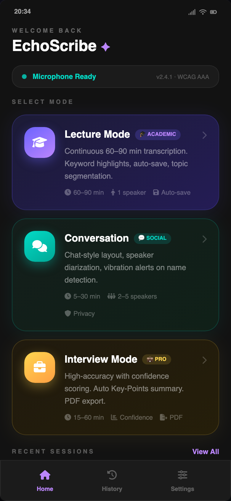

# EchoScribe ✦

> **Real-Time Transcription Assistant for the Hearing Impaired**
> *"Hear Through Words"*

  

# EchoScribe ✦
**Real-Time Transcription Assistant for the Hearing Impaired**

> An academic Human-Computer Interaction (HCI) engineering project focused on discreet, real-time speech-to-text translation. Developed as a final-year Software Engineering project.

## 📖 Project Overview
EchoScribe is a high-fidelity, interactive Single-Page Application (SPA) prototype designed to bridge communication gaps for the hearing-impaired community. Engineered with a strict focus on usability and accessibility, it provides contextual transcription interfaces tailored for lectures, casual conversations, and professional interviews.

## 🚀 Technical Architecture
As a final-year Software Engineering project, the architecture prioritizes performance, zero-dependency rendering, and strict adherence to web accessibility standards.
* **Core Stack:** Vanilla JavaScript (ES6+), Semantic HTML5, CSS3.
* **Styling Engine:** Tailwind CSS for utility-first responsive design, coupled with custom Glassmorphism CSS for depth and visual hierarchy.
* **State Management:** Custom event-driven DOM routing and state handling without heavy reactive frameworks to ensure lightweight execution.

## 🧠 Applied HCI & UX Heuristics
Every UI component was rigorously evaluated against core HCI principles:
1. **Fitts’s Law Implementation:** The primary navigation and interaction zones (Bottom Sheet Navigation) are mapped to the mobile "Thumb Zone" for frictionless one-handed operation.
2. **Visibility of System Status:** Live SVG waveform animations and pulsing indicators provide continuous visual feedback of microphone activity.
3. **Accessibility (a11y) & WCAG AAA:** The entire interface is natively built in Dark Mode (High Contrast), specifically reducing visual fatigue and complying with strict WCAG AAA color contrast ratios.
4. **Error Prevention & Recovery:** Destructive actions (like ending a session) require confirmation modals, while background auto-saving guarantees data integrity.
5. **Recognition over Recall:** Contextual color-coding (Purple for Academic, Teal for Social, Gold for Professional) significantly reduces cognitive load.

## 🛠️ Core Features
* **Lecture Mode:** Infinite scroll transcription with automatic keyword extraction and term highlighting.
* **Conversation Mode:** Speaker diarization rendered in a familiar asymmetric chat-bubble UI.
* **Interview Mode:** Professional layout featuring real-time AI confidence scoring and automated Key-Points summarization.

## 👨‍💻 Author & Academic Context
**Sherif Khoga** (ID: 210209461)  
*Final-Year Software Engineering Student*  
**Üsküdar University (Faculty of Engineering and Natural Sciences)** — Human-Computer Interaction (HCI) Course  

---
*Note: This repository contains the front-end UI/UX engineering prototype. Live transcription logic is visually simulated for academic demonstration purposes.*
